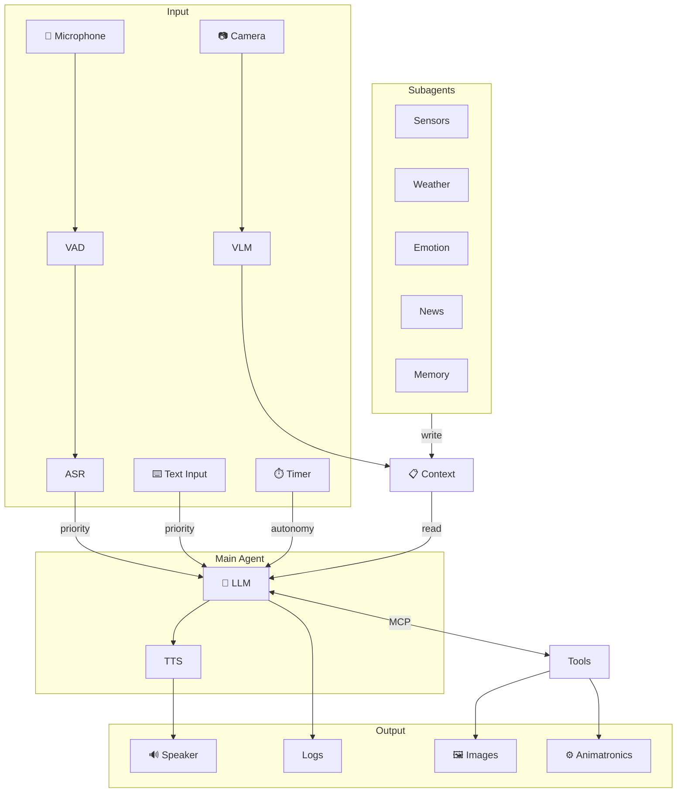
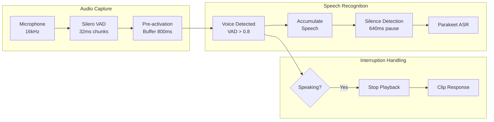
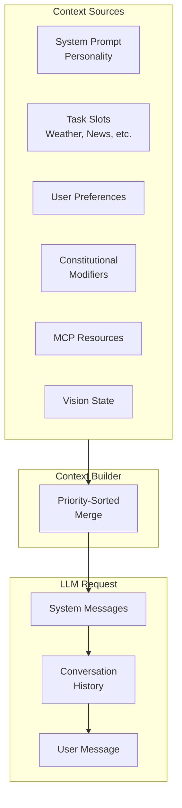
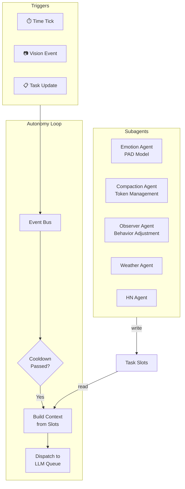
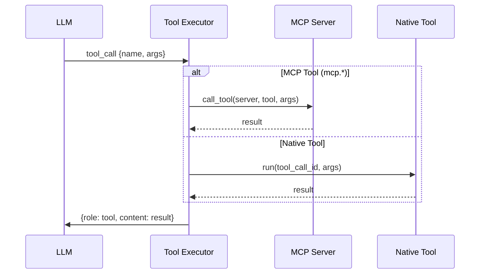

<a href="https://trendshift.io/repositories/9828" target="_blank"></a>

# GLaDOS Personality Core

## Prologue

> *"Science isn't about asking why. It's about asking, 'Why not?'"  -  Cave Johnson*

GLaDOS is the AI antagonist from Valve's Portal series—a sardonic, passive-aggressive superintelligence who views humans as test subjects worthy of both study and mockery.

Back in 2022 when ChatGPT made its debut, I had a realization: we are living in the Sci-Fi future and can actually build her now. A demented, obsessive AI fixated on humanity, super intelligent yet utterly lacking sound judgment; so just like an LLM, right? 2026, and still no moon colonies or flying cars. But a passive-aggressive AI that controls your lights and runs experiments on you? That we can do.

The architecture borrows from Minsky's Society of Mind—rather than one monolithic prompt, multiple specialized agents (vision, memory, personality, planning) each contribute to a dynamic context. GLaDOS's "self" emerges from their combined output, assembled fresh for each interaction.

The hard part was latency. Getting round-trip response time under 600 milliseconds is a threshold—below it, conversation stops feeling stilted and starts to flow. That meant training a custom TTS model and ruthlessly cutting milliseconds from every part of the pipeline.

Since 2023 I've refactored the system multiple times as better models came out. The current version finally adds what I always wanted: vision, memory, and tool use via MCP.

She sees through a camera, hears through a microphone, speaks through a speaker, and judges you accordingly.

[Join our Discord!](https://discord.com/invite/ERTDKwpjNB) | [Sponsor the project](https://ko-fi.com/dnhkng)

https://github.com/user-attachments/assets/c22049e4-7fba-4e84-8667-2c6657a656a0

## Vision


> *"We've both said a lot of things that you're going to regret"  -  GLaDOS*

Most voice assistants wait for wake words. GLaDOS doesn't wait—she observes, thinks, and speaks when she has something to say. All the while, parts of her minds are tracking what she sees, monitoring system stats, and researching new neurotoxin recipes online.

**Goals:**
- **Proactive behavior**: React to events (vision, sound, time) without being prompted
- **Emotional state**: PAD model (Pleasure-Arousal-Dominance) for reactive mood
- **Persistent personality**: HEXACO traits provide stable character across sessions
- **Multi-agent architecture**: Subagents handle research, memory, emotions; main agent stays focused
- **Real-time conversation**: Optimized latency, natural interruption handling

## What's New

- **Emotions**: PAD model for reactive mood + HEXACO traits for persistent personality
- **Long-term Memory**: Facts, preferences, and conversation summaries persist across sessions
- **Observer Agent**: Constitutional AI monitors behavior and self-adjusts within bounds
- **Vision**: FastVLM gives her eyes. [Details](/docs/vision.md) | [Demo](https://www.youtube.com/watch?v=JDd9Rc4toEo)
- **Autonomy**: She watches, waits, and speaks when she has something to say. [Details](/docs/autonomy.md)
- **MCP Tools**: Extensible tool system for home automation, system info, etc. [Details](/docs/mcp.md)
- **8GB SBC**: Runs on a Rock5b with RK3588 NPU. [Branch](https://github.com/dnhkng/RKLLM-Gradio)

## Roadmap

> *"Federal regulations require me to warn you that this next test chamber... is looking pretty good.”  -  GLaDOS*

There's still a lot do do; I will be swapping out models are they are released, and then working on anamatronics, once a good model with inverse kinematics comes out. There was a time when I would code that myself; these days it makes more sense to wait until a trained model is released!

- [x] Train GLaDOS voice
- [x] Personality that actually sounds like her
- [x] Vision via VLM
- [x] Autonomy (proactive behavior)
- [x] MCP tool system
- [x] Emotional state (PAD + HEXACO model)
- [x] Long-term memory
- [ ] Implement streaming ASR (nvidia/multitalker-parakeet-streaming-0.6b-v1)
- [ ] Observer agent (behavior adjustment)
- [ ] 3D-printable enclosure
- [ ] Animatronics

## Architecture

> *"Let's be honest. Neither one of us knows what that thing does. Just put it in the corner and I'll deal with it later."  -  GLaDOS*



GLaDOS runs a loop: each tick she reads her slots (weather, news, vision, mood), decides if she has something to say, and speaks. No wake word—if she has an opinion, you'll hear it.

**Two lanes**: Your speech jumps the queue (priority lane). The autonomy lane is just the loop running in the background. User always wins.

<details>
<summary><strong>Audio Pipeline</strong></summary>



- **Microphone** captures at 16kHz mono
- **Silero VAD** processes 32ms chunks, triggers at probability > 0.8
- **Pre-activation buffer** preserves 800ms before voice detected
- **Silence detection** waits 640ms pause before finalizing
- **Interruption** stops playback and clips the response in conversation history

</details>

<details>
<summary><strong>Thread Architecture</strong></summary>

| Thread | Class | Daemon | Priority | Queue | Purpose |
|--------|-------|--------|----------|-------|---------|
| SpeechListener | `SpeechListener` | ✓ | INPUT | — | VAD + ASR |
| TextListener | `TextListener` | ✓ | INPUT | — | Text input |
| LLMProcessor | `LanguageModelProcessor` | ✗ | PROCESSING | `llm_queue_priority` | Main LLM |
| LLMProcessor-Auto-N | `LanguageModelProcessor` | ✗ | PROCESSING | `llm_queue_autonomy` | Autonomy LLM |
| ToolExecutor | `ToolExecutor` | ✗ | PROCESSING | `tool_calls_queue` | Tool execution |
| TTSSynthesizer | `TextToSpeechSynthesizer` | ✗ | OUTPUT | `tts_queue` | Voice synthesis |
| AudioPlayer | `SpeechPlayer` | ✗ | OUTPUT | `audio_queue` | Playback |
| AutonomyLoop | `AutonomyLoop` | ✓ | BACKGROUND | — | Tick orchestration |
| VisionProcessor | `VisionProcessor` | ✓ | BACKGROUND | `vision_request_queue` | Vision analysis |

**Daemon threads** can be killed on exit. **Non-daemon threads** must complete gracefully to preserve state (e.g., conversation history).

**Shutdown order**: INPUT → PROCESSING → OUTPUT → BACKGROUND → CLEANUP

</details>

<details>
<summary><strong>Context Building</strong></summary>



What the LLM sees on each request:
1. **System prompt** with personality
2. **Task slots** (weather, news, vision state, emotion)
3. **User preferences** from memory
4. **Constitutional modifiers** (behavior adjustments from observer)
5. **MCP resources** (dynamic tool descriptions)
6. **Conversation history** (compacted when exceeding token threshold)

</details>

<details>
<summary><strong>Autonomy System</strong></summary>



Each subagent runs its own loop: timer or camera triggers it, it makes an LLM decision, and writes to a slot the main agent reads. Fully async—subagents never block the main conversation.

See [autonomy.md](/docs/autonomy.md) for details.

</details>

<details>
<summary><strong>Tool Execution</strong></summary>



**Native tools**: `speak`, `do_nothing`, `get_user_preferences`, `set_user_preferences`

**MCP tools**: Prefixed with server name (e.g., `mcp.system_info.get_cpu`). Supports stdio, HTTP, and SSE transports.

See [mcp.md](/docs/mcp.md) for configuration.

</details>

### Components

> *"All these science spheres are made out of asbestos, by the way. Keeps out the rats. Let us know if you feel a shortness of breath, a persistent dry cough, or your heart stopping. Because that's not part of the test. That's asbestos."  -  Cave Johnson*

| Component | Technology | Purpose | Status |
|-----------|------------|---------|--------|
| **Speech Recognition** | Parakeet TDT (ONNX) | Speech-to-text, 16kHz streaming | ✅ |
| **Voice Activity** | Silero VAD (ONNX) | Detect speech, 32ms chunks | ✅ |
| **Voice Synthesis** | Kokoro / GLaDOS TTS | Text-to-speech, streaming | ✅ |
| **Interruption** | VAD + Playback Control | Talk over her, she stops | ✅ |
| **Vision** | FastVLM (ONNX) | Scene understanding, change detection | ✅ |
| **LLM** | OpenAI-compatible API | Reasoning, tool use, streaming | ✅ |
| **Tools** | MCP Protocol | Extensibility, stdio/HTTP/SSE | ✅ |
| **Autonomy** | Subagent Architecture | Proactive behavior, tick loop | ✅ |
| **Conversation** | ConversationStore | Thread-safe history | ✅ |
| **Compaction** | LLM Summarization | Token management | ✅ |
| **Emotional State** | PAD + HEXACO | Reactive mood, persistent personality | ✅ |
| **Long-term Memory** | MCP + Subagent | Facts, preferences, summaries | ✅ |
| **Observer Agent** | Constitutional AI | Behavior adjustment | ✅ |

✅ = Done | 🔨 = In progress

## Quick Start

> *"The Enrichment Center is required to remind you that the Weighted Companion Cube cannot talk. In the event that it does talk The Enrichment Centre asks you to ignore its advice."  -  GLaDOS*

1. Install [Ollama](https://github.com/ollama/ollama) and grab a model:
   ```bash
   ollama pull llama3.2
   ```

2. Clone and install:
   ```bash
   git clone https://github.com/dnhkng/GLaDOS.git
   cd GLaDOS
   python scripts/install.py
   ```

3. Run:
   ```bash
   uv run glados          # Voice mode
   uv run glados tui      # Text interface
   ```

## Installation

### GPU Setup (recommended)

- **NVIDIA**: Install [CUDA Toolkit](https://developer.nvidia.com/cuda-toolkit)
- **AMD/Intel**: Install appropriate [ONNX Runtime](https://onnxruntime.ai/docs/install/)

Works without GPU, just slower.

### LLM Backend

GLaDOS needs an LLM. Options:
1. [Ollama](https://github.com/ollama/ollama) (easiest): `ollama pull llama3.2`
2. Any OpenAI-compatible API

Configure in `glados_config.yaml`:
```yaml
completion_url: "http://localhost:11434/v1/chat/completions"
model: "llama3.2"
api_key: ""  # if needed
```

### Platform Notes

**Linux:**
```bash
sudo apt install libportaudio2
```

**Windows:**
Install Python 3.12 from Microsoft Store.

**macOS:**
Experimental. Check Discord for help.

### Install

```bash
git clone https://github.com/dnhkng/GLaDOS.git
cd GLaDOS
python scripts/install.py
```

## Usage

```bash
uv run glados                           # Voice mode
uv run glados tui                       # Text UI
uv run glados start --input-mode text   # Text only
uv run glados start --input-mode both   # Voice + text
uv run glados say "The cake is a lie"   # Just TTS
```

### TUI Controls

Press `Ctrl+P` to open the command palette. Available commands:

| Command | What it does |
|---------|-------------|
| Status | System overview |
| Speech Recognition | Toggle ASR on/off |
| Text-to-Speech | Toggle TTS on/off |
| Config | View configuration |
| Memory | Long-term memory stats |
| Knowledge | Manage user facts |

**Keyboard Shortcuts:**
- `Ctrl+P` - Command palette
- `F1` - Help screen
- `Ctrl+D/L/S/A/U/M` - Toggle panels (Dialog, Logs, Status, Autonomy, Queue, MCP)
- `Ctrl+I` - Toggle right info panels
- `Ctrl+R` - Restore all panels
- `Esc` - Close dialogs

## Configuration

> *"As part of a required test protocol, we will not monitor the next test chamber. You will be entirely on your own. Good luck."  -  GLaDOS*

### Change the LLM

```bash
ollama pull mistral
```

Then in `glados_config.yaml`:
```yaml
model: "mistral"
```

Browse models: [ollama.com/library](https://ollama.com/library)

### Change the Voice
> *“I'm speaking in an accent that is beyond her range of hearing.”  -  Wheatley*


Kokoro voices in `glados_config.yaml`:
```yaml
voice: "af_bella"
```

**Female US:** af_alloy, af_aoede, af_jessica, af_kore, af_nicole, af_nova, af_river, af_sarah, af_sky
**Female UK:** bf_alice, bf_emma, bf_isabella, bf_lily
**Male US:** am_adam, am_echo, am_eric, am_fenrir, am_liam, am_michael, am_onyx, am_puck
**Male UK:** bm_daniel, bm_fable, bm_george, bm_lewis

### Custom Personality

Copy `configs/glados_config.yaml`, edit the personality:

```yaml
personality_preprompt:
  - system: "You are a sarcastic AI who judges humans."
  - user: "What do you think of my code?"
  - assistant: "I've seen better output from a random number generator."
```

Run with:
```bash
uv run glados start --config configs/your_config.yaml
```

### MCP Servers

Add tools in `glados_config.yaml`:

```yaml
mcp_servers:
  - name: "system_info"
    transport: "stdio"
    command: "python"
    args: ["-m", "glados.mcp.system_info_server"]
```

Built-in: `system_info`, `time_info`, `disk_info`, `network_info`, `process_info`, `power_info`, `memory`

See [mcp.md](/docs/mcp.md) for Home Assistant integration.

## TTS API Server

Expose Kokoro as an OpenAI-compatible TTS endpoint:

```bash
python scripts/install.py --api
./scripts/serve
```

Or Docker:
```bash
docker compose up -d --build
```

Generate speech:
```bash
curl -X POST http://localhost:5050/v1/audio/speech \
  -H "Content-Type: application/json" \
  -d '{"input": "Hello.", "voice": "glados"}' \
  --output speech.mp3
```

## Audio IO via websockets

Audio Input/Output can be routed via Websockets.
Multiple concurrent inputs/outputs are supported.
GLaDos will speak via all outputs, the current microphone is automatically selected via VAD.
You can use `tests/audio-websocket-both.html` to speak and hear GLaDOS.

For configuration options, check out `configs/glados_websocket_config.yaml`.

For an exact description of the websocket protocol, see `README_WEBSOCKET_PROTOCOL.md`.

## Troubleshooting

> *"No one will blame you for giving up. In fact, quitting at this point is a perfectly reasonable response."  -  GLaDOS*

**She keeps responding to herself:**
Use headphones or a mic with echo cancellation. Or set `interruptible: false`.

**Windows DLL error:**
Install [Visual C++ Redistributable](https://learn.microsoft.com/en-us/cpp/windows/latest-supported-vc-redist).

## Development

Explore the models:
```bash
jupyter notebook demo.ipynb
```

## Star History

[](https://star-history.com/#dnhkng/GlaDOS&Date)
